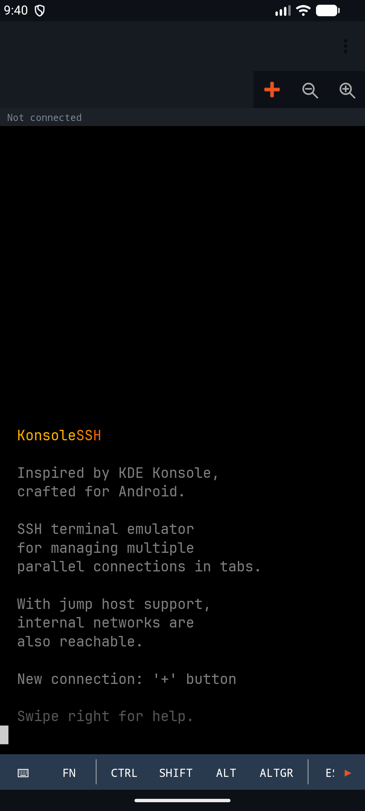
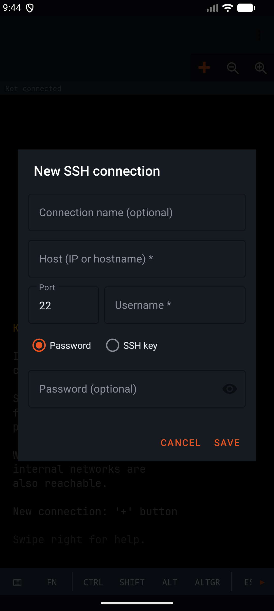
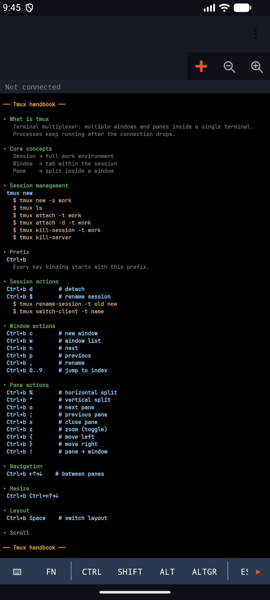
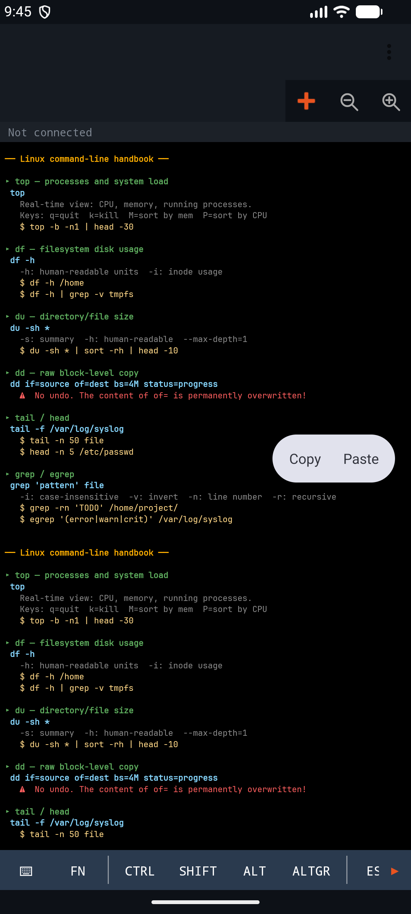

# KonsoleSSH

SSH terminál s viacerými kartami pre Android — inšpirovaný KDE Konsole.

> **Jazyk:** Slovenčina · [English](README.md) · [Magyar](README.hu.md) · [Español](README.es.md) · [Deutsch](README.de.md) · [Français](README.fr.md) · [Română](README.ro.md)

## Snímky obrazovky

| Úvodná obrazovka | Nové SSH pripojenie |
| --- | --- |
|  |  |

| Tmux šablóna | Linux šablóna |
| --- | --- |
|  |  |

## Funkcie

### Karty a navigácia

- **Rozhranie s viacerými kartami** — TabLayout + ViewPager2, každá karta vlastní nezávislú SSH reláciu identifikovanú pomocou `TabInfo` založenej na UUID
- **Tri fixné stránky** — úvodná obrazovka (pozícia 0), Linux ťahák a tmux ťahák (posledné dve pozície); SSH karty sú medzi nimi
- **Bodka indikátora stavu pripojenia na každej karte** — zelená (CONNECTED), žltá (CONNECTING), červená (DISCONNECTED), skrytá (NONE)
- **Dlhé stlačenie karty** → dialóg premenovania
- **Tlačidlo ✕ na karte** — pýta potvrdenie pri aktívnych reláciách; odpojenú kartu zatvára okamžite
- **Posúvanie riadku kariet** — keď sa karty nezmestia, zobrazia sa jemne pulzujúce ukazovatele ◀/▶ (ObjectAnimator ±8 dp, 900 ms reverzne nekonečne)
- **Výška indikátora karty nastavená na 0 dp** pri jednej karte (menej vizuálneho šumu)

### Výber kariet / uložené pripojenia (`+` menu)

- **BottomSheetDialogFragment** — na celú výšku (STATE_EXPANDED, MATCH_PARENT)
- **Aktívne karty + strom uložených pripojení**, poskladané na sebe
- **Stromové zoskupovanie podľa prefixu s podčiarkovníkom** — `acme_prod_web`, `acme_prod_db` → skupina `acme_` → `prod_`; osamotený list sa nezoskupuje
- **Odsadenie podľa hĺbky** — `16 dp + hĺbka × 20 dp`
- **Rozbalený stav prežije znovuotvorenie dialógu** (podopreté companion-objectom)
- **Ikony** — skupina: 📁 / 📂 (zatvorená/otvorená), list: ⚡
- **Riadky listov** — podriadok `user@host:port`, úprava + vymazanie vpravo
- **Riadky skupín** — podriadok s počtom listov, šípka ▶/▼ vpravo
- **Predvyplnenie nedávno použitého používateľského mena** pri novom pripojení

### Dialóg Nové / Upraviť

- **Režim úpravy** — celý `ConnectionConfig` serializovaný Gsonom cez Bundle a obnovený do polí
- **Prepínač autentifikácie** RadioGroup: heslo ↔ súkromný kľúč, nepotrebný layout sa automaticky skryje
- **Súkromný kľúč s výberom súboru** (náhľad len na čítanie), samostatné pole pre prístupovú frázu
- **Upozornenie na `.pub`** — toast, ak sa používateľ pokúsi načítať verejnú polovicu kľúča
- **Riadok stavu kľúča** — PEM načítaný / zlyhal / žiadny
- **Spinner jump hostu** — zoznam uložených pripojení (bez seba samého)
- **Automatický návrh jump hostu** — deteguje prefixy privátnych IP (`10.`, `172.`, `192.`) a rozbalí sekciu jump
- **Validácia** — host a používateľské meno povinné; port 1 – 65535, predvolene 22

### Autentifikácia pripojenia

- **JSch (mwiede fork)** — heslo, publickey alebo oboje kombinované (`buildPreferredAuths`)
- **Interaktívna výzva na heslo** — keď nie je uložené, zobrazí sa AlertDialog v štýle `KonsoleDialog` (biely text, priehľadné pozadie)
- **Keyboard-interactive autentifikácia** — výzvy zo strany servera idú cez rovnaký dialóg
- **30 s časový limit výzvy** (CountDownLatch) — volajúce vlákno sa čisto uvoľní, ak používateľ neodpovie
- **Ochrana hlavného vlákna** — dialóg sa vždy zobrazí na UI vlákne (Handler post)
- **Reťazec jump hostu** — `setPortForwardingL(0, target_host, target_port)` z mwiede forku na náhodnom porte + druhá relácia na loopback
- **Správy o priebehu jumpu** vypisované do terminálu — `Jump: host:port → Connecting`, potom `Jump OK → Connecting: target:port`
- **Chyba "Jump host sa nenašiel"** — keď odkazované ID jump pripojenia už neexistuje

### Emulátor terminálu (na báze Canvas)

**Vykresľovanie**

- Vlastný `TerminalView`, `canvas.drawText` po bunkách, minimálny základ 80×24
- Polia bunky: znak (String, vedomý surrogate-pair), fg/bg, tučné, podčiarknuté, inverzné
- **NerdFont priložený** (`assets/fonts/NerdFont.ttf`); pri chybe sa použije `Typeface.MONOSPACE`
- Rozsah písma 6 sp … 40 sp; prvé rozloženie sa automaticky prispôsobí cieľu 80 stĺpcov
- **Tlačidlá zoom +/−** na paneli nástrojov (`SharedPreferences("settings", "font_size")`), pretrvá medzi reštartmi
- **Veľkosť písma na úrovni aplikácie** (nie na pripojenie)
- Podčiarknutie vykreslené cez `drawLine` na cellH-1
- Inverzia kurzora pri vykresľovaní (fg↔bg)
- **Blikanie kurzora** 600 ms zapnuté / 300 ms vypnuté

**ANSI/VT stavový automat**

- Stavy NORMAL / ESCAPE / CSI / OSC / DCS / CHARSET
- SGR: 16 základných + 8 jasných + 256-cube + truecolor (`38;2;r;g;b`), bold/underline/reverse + resety
- Kurzor: A/B/C/D, H/f, G, E/F, s/u, ESC 7/8 (DEC legacy)
- Mazanie: J, K, X, L/M (vkladanie/mazanie riadkov), P/@ (znaky)
- **Oblasť posunu** — r, S/T (posun hore/dole)
- **Alt screen** — prepínač 47 / 1049 (vi, top, less, mc zachovávajú a obnovujú obrazovku)
- **DECCKM app-cursor režim** — `ESC[A/B/C/D` ↔ `ESC O A/B/C/D`
- **Bracketed paste mode** (2004) — vložený text zabalený do `ESC[200~ … ESC[201~`

**Výber textu**

- **Dlhé stlačenie 400 ms** → spustí výber, plávajúci `ActionMode` (Copy/Paste)
- Sledovanie koncového bodu naživo počas ťahania, `invalidateContentRect`
- Normalizácia smeru dopredu/dozadu
- `buildSelectedText` — oreže každý riadok, spojí cez `\n`
- Klepnutie počas výberu → zruší výber
- **Blokovanie swipe ViewPageru** (`requestDisallowInterceptTouchEvent`) počas výberu/posúvania

**Posúvanie a dotyk**

- Zvislé posúvanie: `scrollRowOff` 0 … `scrollback.size`
- **Scrollback** kruhový buffer 3000 riadkov
- Vodorovné posúvanie je voliteľné (na úvodnej stránke vypnuté)
- **Prah posunu 8 px** — rozlíšenie klepnutia a posúvania
- Automatická gravitácia nadol pri novom výstupe (`scrollRowOff = 0`)
- Klepnutie → `focusAndShowKeyboard()`
- **Shift+PageUp/Down** na hardvérovej klávesnici posúva scrollback

**Integrácia IME**

- Vlastný `TerminalInputConnection` (BaseInputConnection)
- Trik so sentinelom: buffer vždy začína jednou sentinel medzerou, používateľský vstup používa `removePrefix`
- Funguje so swipe/glide IME
- `deleteSurroundingText` → manuálny tok bajtov DEL (0x7F)
- `inputType=TYPE_NULL` — v termináli žiadne automatické dopĺňanie ani návrhy

### Hardvérová klávesnica

- Enter→13, Tab→9, Esc→27, DEL→127
- Home/End → `ESC[H` / `ESC[F`
- PageUp/PageDown → `ESC[5~` / `ESC[6~`
- **F1–F12** → `ESC O P/Q/R/S`, `ESC[15~`, `ESC[17~`, …
- Šípky → kódy podľa app-cursor režimu
- Shift+PageUp/Down odklonené do scrollbacku (neposielajú sa ako vstup)

### Lišta klávesov na obrazovke

**Hlavný riadok** (40 dp)

- **⌨** — prepína systémové IME. Skutočná viditeľnosť IME sa číta cez `WindowInsetsCompat`, takže klávesnica zatvorená gestom späť sa čisto znovu otvorí.
- **Fn** — prepína riadok F1–F12
- **CTRL / SHIFT / ALT / ALTGR** — lepivé modifikátory, zvýraznené cez `keybar_mod_active` kým sú aktívne; **automatický reset** po odoslaní ľubovoľnej klávesy
- **CTRL** navyše otvára samostatný riadok kombinácií Ctrl (A/B/C/D/V/Z)
- **ESC, TAB** — priamy bajt
- **↑** — prepína riadok so šípkami (← ↑ ↓ →)
- **📁** — `ActivityResultContracts.OpenDocument()` → SFTP nahrávanie
- Vizuálne oddeľovače `KeyBarDivider` medzi nimi

**Fn riadok** (36 dp) — escape sekvencie F1–F12, každé stlačenie sa **rozsvieti** na 300 ms (akcentová farba)

**Ctrl riadok** — dynamicky generovaný (`LayoutInflater` + `item_keybar_button`)

- `Ctrl+C`: skopíruje výber do schránky v aplikácii s toastom, inak pošle ETX (0x03)
- `Ctrl+V`: vloží zo schránky v aplikácii → `pasteText` + toast
- A/B/D/Z: kód = char - 'A' + 1 (1 … 26)

**Riadok so šípkami** (36 dp) — ← ↑ ↓ → rešpektujúc app-cursor režim

**Ukazovatele posunu na každom riadku** — ◀/▶ animované len keď sa skutočne dá posúvať; `canScrollHorizontally(±1)` kontrolované po každej udalosti; animátor zrušený + resetovaný v onDestroy

### Špeciálne kombinácie klávesov (`applyModifiers`)

- Ctrl+písmeno → 1 … 26 (štandardné riadiace kódy)
- **Ctrl+space → 0x00 (NUL)**
- **Ctrl+[ → 27 (ESC)**
- Shift + malé písmeno → veľké (fallback pre soft input)
- Alt / AltGr → `ESC` + pôvodný bajt (meta prefix)

### Schránka

**Schránka v aplikácii** (`TerminalClipboard`)

- Singleton `var text: String?`
- Ctrl+C s výberom → schránka **v aplikácii** (nie systémová) + diskrétny toast
- Ctrl+V → schránka v aplikácii → `pasteText`

**Systémová schránka**

- ActionMode **Copy** → `ClipboardManager.setPrimaryClip`
- ActionMode **Paste** → `coerceToText` → `pasteText`
- Pri vložení `\n` → `\r`, zabalené, ak je aktívny bracketed paste mode

### Nahrávanie súboru cez SFTP

- 📁 → selektor `OpenDocument`
- Názov súboru z `OpenableColumns.DISPLAY_NAME`, fallback `uri.lastPathSegment`
- Dotaz na veľkosť → prepínač medzi určitým a neurčitým progress barom
- **Dialóg priebehu** — názov súboru, `X.X MB / Y.Y MB` alebo `Z.Z MB`, ak celková veľkosť nie je známa, `setCancelable(false)`
- Pri úspechu `KonsoleToast.showWithAction` — "Nahraté: ~/filename" + tlačidlo **Späť** → `deleteRemoteFile`
- Pri chybe lokalizované hlásenie mapované cez friendlyError

### Stav a spätná väzba

- **Stavový riadok** (20 dp) nad terminálom: `Žiadne pripojenie`, `Pripájanie: host…`, `Pripojené: host`, `Odpojené: host`
- **Tlačidlo opätovného pripojenia** v strede terminálu, ikona ↺, zobrazené len v stave DISCONNECTED
- **KonsoleToast** — vlastný toast, spodný okraj 100 dp, predvolene 4000 ms / 3000 ms s akciou, animácia zatvárania (scale+alpha, 250 ms)

### Chybové hlásenia (mapovanie friendlyError)

Surové JSch výnimky sú mapované na čitateľný text (lokalizovaný):

- `connection refused` → "Server odmietol pripojenie"
- `timed out` / `timeout` → "Vypršal časový limit"
- `no route to host` → "Neexistuje cesta k hostiteľovi"
- `network unreachable` → "Sieť nie je dostupná"
- `unknown host` → "Neznámy hostiteľ"
- `auth fail` / `authentication` → "Autentifikácia zlyhala"
- `connection closed` / `closed by foreign host` → "Pripojenie bolo ukončené"
- `broken pipe` → "Prerušené spojenie"
- `port forwarding`, `channel` → vyhradené hlásenia
- Inak: správa výnimky s odstránenými prefixami tried zo stacku cez regex

### Pozadie a životný cyklus

- **`SshForegroundService`** — `START_STICKY`, zámerne **nezastavuje** relácie pri `onTaskRemoved`
- **Výstupný buffer** — kruhový 256 KB na reláciu, `ByteArrayOutputStream` s orezom pri pretečení
- **Prehranie pri opätovnom pripojení** — po naviazaní fragmentu sa buffer prehrá do terminálu, takže predchádzajúci výstup je viditeľný
- **Dva NotificationChannels** — `ssh_idle` (neaktívny) a `ssh_active` (aktívny), odlišné správanie odznaku
- **Odznak oznámenia** zobrazuje počet aktívnych relácií
- Oznámenie s nízkou prioritou (`PRIORITY_LOW`, `setSilent`)
- `onRebind` povolené (`onUnbind → true`)
- `TerminalFragment.onDestroy` **neodpája** (reláciu vlastní služba)
- Vedenie zoznamu listenerov cez `onAttach`/`onDetach` (bezpečné proti únikom pamäte)

### Stavový automat indikátora pripojenia

- `NONE → CONNECTING`: nové volanie `connect()`
- `CONNECTING → CONNECTED`: shell kanál otvorený (`onConnected`)
- `CONNECTING → DISCONNECTED`: `onError` (auth, timeout, refused)
- `CONNECTED → DISCONNECTED`: čítacia slučka skončí alebo explicitné `disconnectSession`
- `DISCONNECTED → CONNECTING`: tlačidlo opätovného pripojenia

### Bezpečnosť

- **EncryptedSharedPreferences** — schéma hodnôt AES256_GCM, schéma kľúčov AES256_SIV, MasterKey podopretý Android Keystore
- **Migrácia zastaraných údajov** pri prvom spustení — staré profily v čistom texte sa presunú do šifrovaného úložiska, potom sa staré úložisko vyčistí
- **Fallback na obyčajné prefs** — ak inicializácia keystore zlyhá (zalogované varovanie), profily sa nestratia
- **JSch `StrictHostKeyChecking=no`** — trust-on-first-use
- Prihlasovacie údaje nikdy neopustia zariadenie

### Úvodná obrazovka / ťaháky

- **Uvítací banner** — "KonsoleSSH" v troch odtieňoch oranžovej ANSI farby + 9 riadkov popisu (`[38;5;244m` tlmené)
- Fixné písmo 16 sp na úvodnej stránke
- Vodorovné posúvanie na úvodnej stránke vypnuté
- **Linux ťahák** — `top`, `df`, `du`, `dd`, `tail`, `head`, `grep`, `egrep`, `awk`, `sed`, `tr`, `ip`, `mc` + ikona `⚠` pri deštruktívnych príkazoch (`dd`, `sed -i`)
- **Tmux ťahák** — sessions/windows/panes/layouts/prefix/resize/scroll/paste
- **Obsah podľa lokality** — HU a EN napísané samostatne, nie len preklad popiskov
- `scrollToTop()` pri otvorení
- Zmena veľkosti terminálu na ťaháku plne prekreslí (`clear()` + nový banner)

### Edge-to-edge a orientácia

- `ViewCompat.setOnApplyWindowInsetsListener` na každej Activity
- `Type.systemBars() | Type.displayCutout()` + `Type.ime()` spracované spoločne — na šírku obsah zostáva nad navigačným pásom, IME push ho vytlačí nahor
- `screenOrientation=fullSensor` — auto-rotate portrét + krajinu
- `configChanges` nastavené tak, aby Activity pri rotácii nebola zničená
- `windowSoftInputMode=adjustResize`
- `onSizeChanged` → prepočet písma, rekalibrácia termRows/termCols

### Lokalizácia

- 7 jazykov: **angličtina** (predvolene), **maďarčina**, **nemčina**, **španielčina**, **francúzština**, **slovenčina**, **rumunčina**
- `supportsRtl="true"` — pripravené pre budúce RTL jazyky
- Sleduje systémový jazyk
- Obsah ťahákov je tiež lokalizovaný (HU/EN)

### Komfortné detaily

- Fokus sa po zatvorení ActionMode automaticky vráti do terminálu
- Po pustení tlačidla modifikátora sa fokus vráti do terminálu
- Tlačidlo lepivého modifikátora mení farbu, kým je aktívne (jasný vizuálny stav)
- Každé klepnutie na lištu klávesov sa rozsvieti na 300 ms
- DEL (0x7F) posielané ako odlišný kód — nie alternatíva Backspace
- Surrogate pair / emoji uložené ako jeden logický znak na bunku
- Zmena veľkosti terminálu → `resize(tabId, cols, rows)` do PTY (`vim`, `htop` prevezmú novú veľkosť)
- `resetToSentinel` v input-connection po každom commite — stav IME vždy čistý
- Hlásenie "Pripojenie bolo ukončené" vytlačené do terminálu pri odpojení
- Ctrl+C / Ctrl+V zobrazia diskrétny toast: "Skopírované" / "Vložené"
- Tlačidlá používajú ripple `selectableItemBackgroundBorderless`
- Štýl `KonsoleDialog`: biely text, šedý hint, priehľadné pozadie
- Zatvorenie/vymazanie/ukončenie aktívneho pripojenia vždy pýta potvrdenie

### Konštanty

- Časový limit pripojenia: 15 s, shell-connect: 10 s, výzva na heslo: 30 s
- Výstupný buffer: 256 KB / relácia
- Scrollback: 3000 riadkov
- Písmo: 6 sp – 40 sp
- Dlhé stlačenie: 400 ms
- Prah pohybu dotyku: 8 px
- Pulz ukazovateľa posunu: perióda 900 ms, ±8 dp
- Toast: predvolene 4000 ms, s akciou 3000 ms, animácia zatvárania 250 ms
- Spodný okraj KonsoleToast: 100 dp
- Blikanie kurzora: 600 ms zapnuté / 300 ms vypnuté

## Architektúra

Relácie vlastní `SshForegroundService`, nie fragmenty:

- Pripojenia prežijú opätovné vytvorenie activity (rotácia, tlačidlo Späť, odstránenie úlohy)
- `TerminalFragment` sa naviaže/odviaže v `onStart`/`onStop` a pri opätovnom pripojení prehráva výstupný buffer
- `OutputBuffer` uchováva posledných 256 KB výstupu na reláciu

## Štruktúra projektu

```
app/src/main/java/hu/billman/konsolessh/
├── model/           ConnectionConfig, SavedConnections (šifrované prefs)
├── ssh/             SshSession, SshForegroundService
├── terminal/        TerminalView, AnsiParser, TerminalClipboard
└── ui/              MainActivity, TerminalFragment, dialógy, sheets
```

## Build

```
Kotlin       2.2.10
AGP          9.2.0
Gradle       9.4.1
Java target  17
namespace    hu.billman.konsolessh
minSdk       26   (Android 8.0)
targetSdk    35   (Android 15)
```

```bash
# Debug build + jednotkové testy
./gradlew :app:testDebugUnitTest

# Podpísaný release App Bundle (vyžaduje nakonfigurovaný keystore)
./gradlew :app:bundleRelease
```

**Release** build je minifikovaný R8 a zdroje sú zmenšené. Kód pracujúci cez reflexiu
(JSch, Gson modelové triedy) je zachovaný cez `app/proguard-rules.pro`. Vytvára sa
`mapping.txt`, aby Play Console dokázala deobfuskovať stack trace.

## Povolenia

| Povolenie                             | Dôvod                                                     |
| ------------------------------------- | --------------------------------------------------------- |
| `INTERNET`                            | SSH pripojenie                                            |
| `ACCESS_NETWORK_STATE`                | Kontrola stavu siete                                      |
| `CHANGE_NETWORK_STATE`                | Foreground service (typ connectedDevice)                  |
| `FOREGROUND_SERVICE`                  | Spustenie služby na pozadí                                |
| `FOREGROUND_SERVICE_CONNECTED_DEVICE` | Sieťový foreground service (API 34+)                      |
| `POST_NOTIFICATIONS`                  | Trvalé oznámenie o relácii (API 33+)                      |

Nezbierame, nezdieľame ani neposielame žiadne údaje. Prihlasovacie údaje zostávajú na zariadení v šifrovanom úložisku podopretom Keystore.

## Požiadavky

- Android 8.0 (API 26) alebo novší
- Podporovaný režim na výšku aj na šírku

## História verzií

- **1.0.6** — Indikátor stavu po opätovnom pripojení sa správne mení na zelený
  (už nezostáva žltý); ikona klávesnice spoľahlivo otvára IME na Androide 14+
  (skutočná viditeľnosť cez `WindowInsetsCompat` namiesto zastaraného `SHOW_FORCED`)
- **1.0.5** — interná oprava (vynechaná verzia)
- **1.0.4** — nová štíhlejšia `>_` prompt ikona aplikácie (stroke dizajn)
- **1.0.3** — doladená ikona a zdroje pre Play Store
- **1.0.2** — balík premenovaný na `hu.billman.konsolessh`, oprava edge-to-edge insets,
  softvérová klávesnica len na vyžiadanie, SFTP nahrávanie s dialógom priebehu a
  toastom Späť, R8 minifikácia, Gradle 9.4.1 / AGP 9.2.0
- **1.0.1** — `targetSdk = 35`, prvé odoslanie do Play
- **1.0.0** — viackartové SSH, jump host, strom uložených pripojení,
  šablóny Linux a tmux, maďarský preklad
